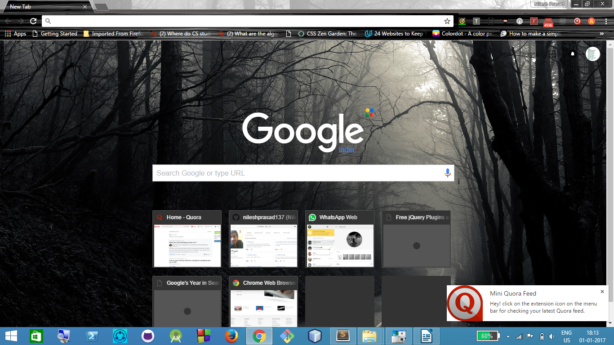
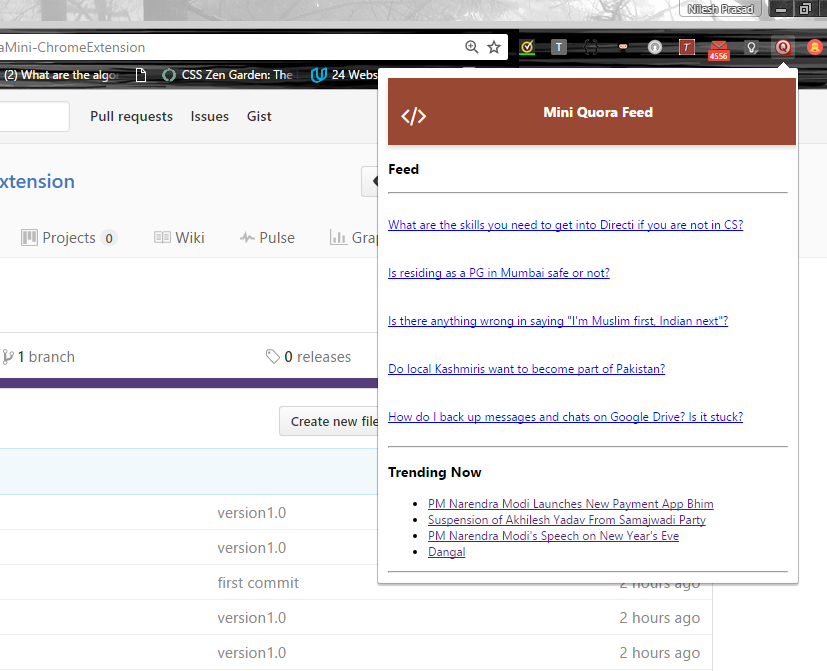
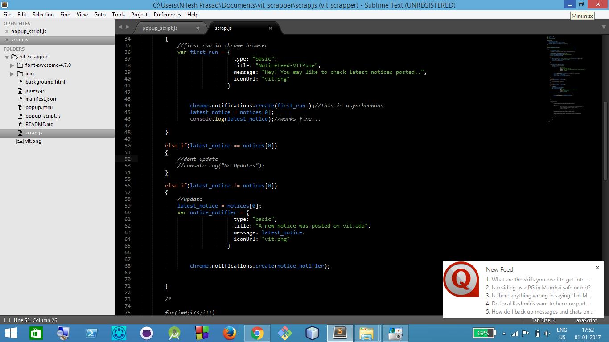

# QuoraMini-ChromeExtension
This Chrome Extension is for Quora readers. It sends desktop notifications periodically with the latest feed in your account.

##Current Features
* Shows if user is logged in to Quora.
* Shows the list of all the trending topics on Quora.
* Shows latest Quora feed , if clicked on the icon on browser .
* Sends desktop notifications for new feed.

##Screenshots
####When browser runs for first time

####Click on the extension icon

####Sends desktop notifications

##Installation
1. [Download Zip Folder](https://github.com/nileshprasad137/QuoraMini-ChromeExtension.git)
2. Extract the folder.
3. Go to Chrome -> Customize -> Tools -> Extensions.
4. Check on developer mode.
5. Load unpacked extension.
6. Select Quora-Chrome-Extension folder.

